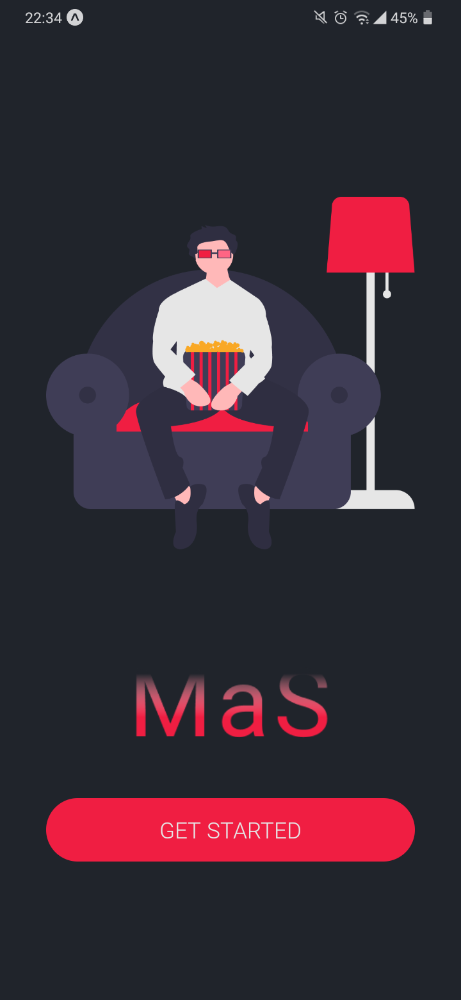
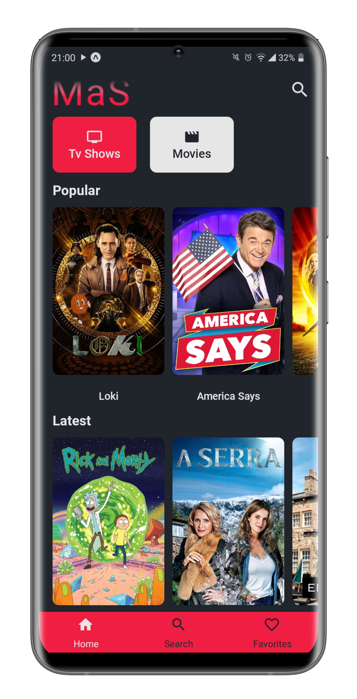
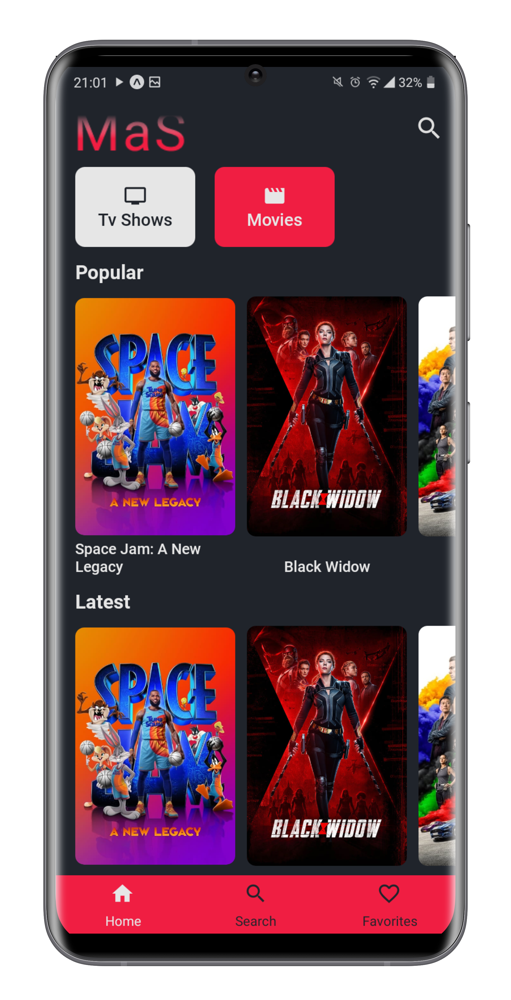
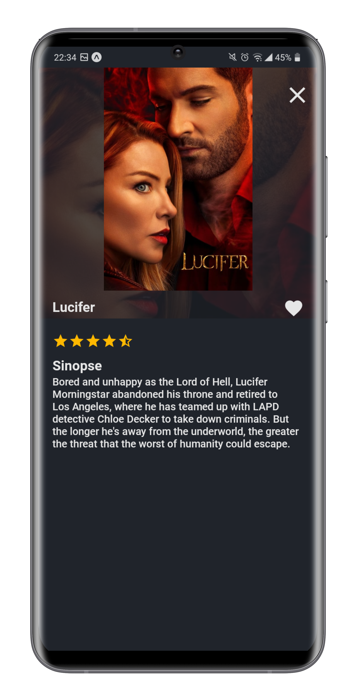
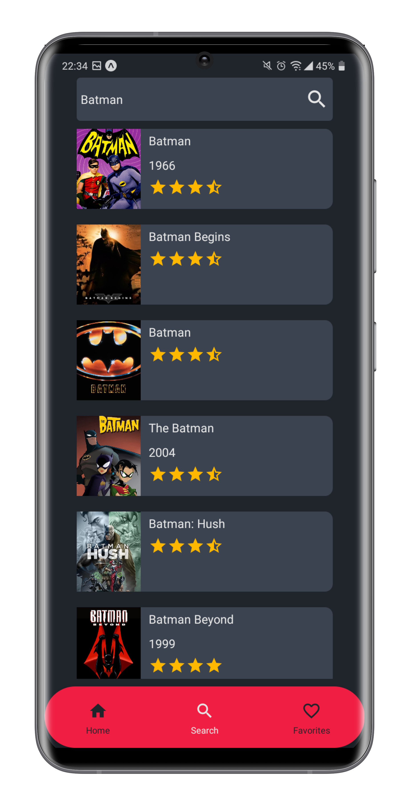
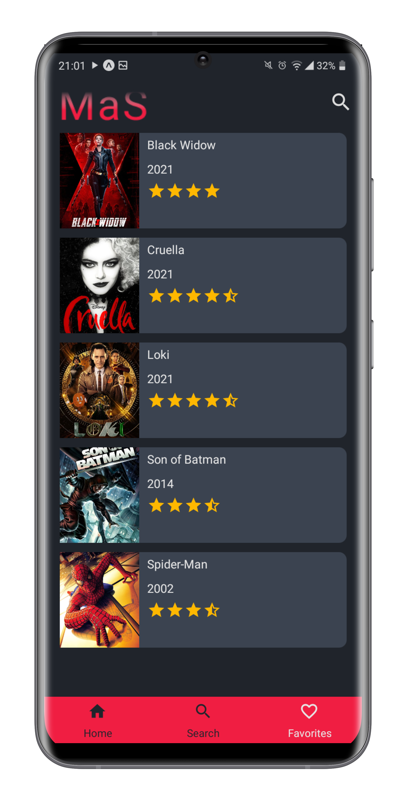

<h1 align="center"> rn-movie-app </h1>

<p align="center">
  <a href="https://github.com/ErickLuizA/rn-movie-app/graphs/commit-activity" alt="Maintenance">
    
  </a>

  <a href="./LICENSE" alt="License: MIT">
    
  </a>

<br/>


<a href="https://github.com/ErickLuizA/rn-movie-app/stargazers">
  
</a>

<p align="center">
  <a href="#clipboard-description">Description</a>&nbsp;&nbsp;&nbsp;|&nbsp;&nbsp;&nbsp;
  <a href="#building_construction-technologies">Technologies</a>&nbsp;&nbsp;&nbsp;|&nbsp;&nbsp;&nbsp;
  <a href="#rocket-getting-started">Getting Started</a>&nbsp;&nbsp;&nbsp;|&nbsp;&nbsp;&nbsp;
  <a href="#memo-license">License</a>&nbsp;&nbsp;&nbsp;|&nbsp;&nbsp;&nbsp;
  <a href="#framed_picture-screenshots">Screenshots</a>
</p>

## :clipboard: Description

rn-movie-app is a app for searching Movies and Series

## :building_construction: Technologies

- [React Native](https://reactnative.dev/)
- [Expo](https://expo.io/)


## :rocket: Getting Started

## 1. Download the repository

```shell
 # With git
 $ git clone https://github.com/ErickLuizA/rn-movie-app.git
 
 # With github cli
 $ gh repo clone ErickLuizA/rn-movie-app
```

## 2. Installation

```shell
# Go into the repository
$ cd rn-movie-app
```

```shell
# Install dependencies
$ npm install or yarn install
```

## 3. Execution

```shell
$ npm start or yarn start
```

## :framed_picture: Screenshots

<div>
  
  
    
  
  
  
</div>

## :memo: License

This project is under the MIT license. See the file [LICENSE](LICENSE) for more details.

---

Build with 💙 By [Erick](https://www.linkedin.com/in/erick-luiz-47151a1a4/)
